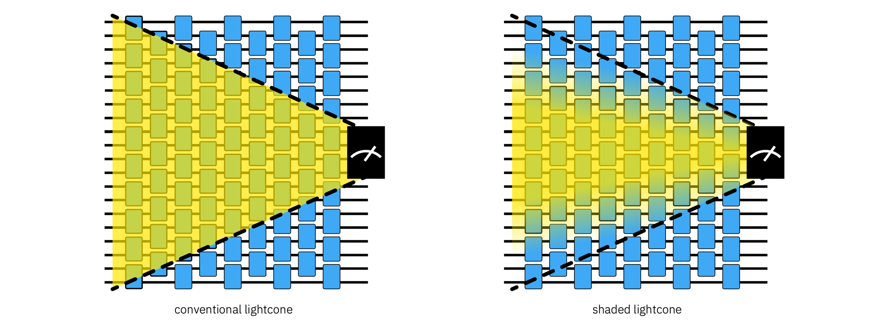
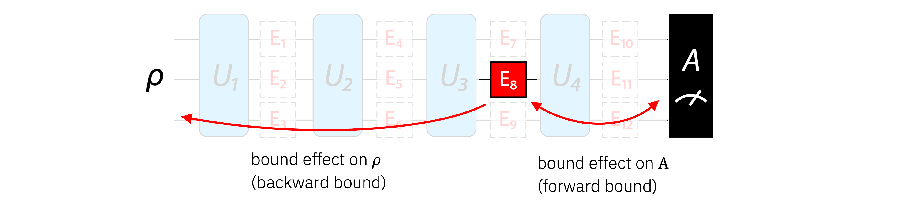
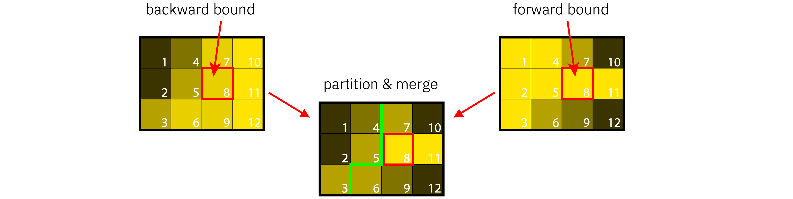
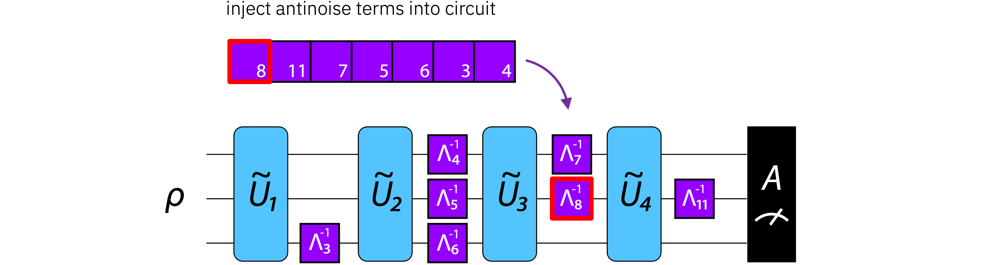

<!-- SHIELDS -->
<div align="left">

  [](https://github.com/Qiskit/qiskit-addon-slc/releases)
  
  [](https://www.python.org/)
  [](https://github.com/Qiskit/qiskit)
<br />
  <!--[](https://zenodo.org/badge/latestdoi/TODO)-->
  [](LICENSE.txt)
  [](https://pypi.org/project/qiskit-addon-slc/)
  [](https://github.com/Qiskit/qiskit-addon-slc/actions/workflows/test_latest_versions.yml)
  [](https://coveralls.io/github/Qiskit/qiskit-addon-slc?branch=main)
</div>

# Shaded lightcones (SLC)



`qiskit-addon-slc` is a package for computing the shaded lightcone (SLC) [[1]](#references) of an
observable with respect to a quantum circuit. In the context of probabilistic error cancellation (PEC), shaded lightcones
are similar to conventional binary lightcones in that not mitigating errors outside the
lightcone can reduce the variance (i.e. sampling cost). Lightcone shading allows this strategy to
be pushed further by assigning scales to Pauli error generators within the causal lightcone.
Errors that are assigned smaller scales have less effect on the observable; truncating them from the
noise model can reduce variance (i.e. sampling cost) at the cost of some bias. The `qiskit-addon-slc` package
gives users the ability to do lightcone shading and control the tradeoff between sampling cost and bias.

----------------------------------------------------------------------------------------------------

### Documentation

All documentation is available at https://quantum.cloud.ibm.com/docs/addons/qiskit-addon-slc.

----------------------------------------------------------------------------------------------------

### Installation

We encourage installing this package via `pip`, when possible:

```bash
pip install qiskit-addon-slc
```

For more installation information refer to these [installation instructions](docs/install.rst).

----------------------------------------------------------------------------------------------------

### Getting started

A simple guide to help you get started quickly with this package is available [here][docs/guides/quickstart.ipynb).

----------------------------------------------------------------------------------------------------

### Use case examples

This technique has been used to improve the sampling cost of PEC on a 20-qubit mirrored Ising circuit [[tutorial]](https://quantum.cloud.ibm.com/docs/en/tutorials/pec-with-shaded-lightcones).

----------------------------------------------------------------------------------------------------

### Technical discussion

#### Method overview

Shaded lightcones are calculated and used in 5 steps:

1. Compute a bound on the effect of each Pauli error term on the observable at the end of the circuit (forward bound)
2. Compute a bound on the effect of each Pauli error term on the initial state at the beginning of the circuit (backward bound)



3. Approximate a bias contribution for each Pauli error term using the forward/backward bounds and the term's error rate



4. Prioritize error terms based on their error rate and bounds. Truncate terms from the noise model which have the least effect on the observable expectation value until the user-specified bias tolerance is hit. Alternatively, one can add the most impactful error terms to a noise model until the user-specified sampling cost budget is filled. 


5. Mitigate the truncated noise model. Although one can mitigate the truncated noise model with any method, mitigating with PEC allows the user to maintain rigorous error bounds on the final expectation value; whereas, methods like probabilistic error amplification (PEA) and propagated noise absorption (PNA) do not provide rigorous error bounds.



#### Software features

- Parallel asynchronous bound computation
- Rust-accelerated propagation
- Permits ahead-of-time bound computation (i.e. prior to the actual noise learning)

#### Known issues

- Windows not supported
- `InjectNoise(site="before")` not supported
- Does not support fine-grained bound merging

#### Future work

- Addressing known issues
- Rust-accelerated eigenvalue computation
- Better guides on custom workflows

----------------------------------------------------------------------------------------------------

### Contributing

The source code is available [on GitHub](https://github.com/Qiskit/qiskit-addon-slc).

The developer guide is located at [CONTRIBUTING.md](https://github.com/Qiskit/qiskit-addon-slc/blob/main/CONTRIBUTING.md)
in the root of this project's repository.
By participating, you are expected to uphold Qiskit's [code of conduct](https://github.com/Qiskit/qiskit/blob/main/CODE_OF_CONDUCT.md).

----------------------------------------------------------------------------------------------------

### Citing this package

If you use this package in your research, use the [CITATION.bib](CITATION.bib) file in this project’s repository to cite the appropriate reference(s).

----------------------------------------------------------------------------------------------------

### License

[Apache License 2.0](LICENSE.txt)

----------------------------------------------------------------------------------------------------

### Deprecation Policy

We follow [semantic versioning](https://semver.org/). We may occasionally make breaking changes in
order to improve the user experience. When possible, we will keep old interfaces and mark them as
deprecated, as long as they can co-exist with the new ones. Each substantial improvement, breaking
change, or deprecation will be documented in the [release notes](https://quantum.cloud.ibm.com/docs/api/qiskit-addon-slc/release-notes).

----------------------------------------------------------------------------------------------------

### References

[1] Andrew Eddins, et al., [Lightcone shading for classically accelerated quantum error mitigation](https://arxiv.org/abs/2409.04401v1), arXiv:2409.04401v1 [quant-ph].
